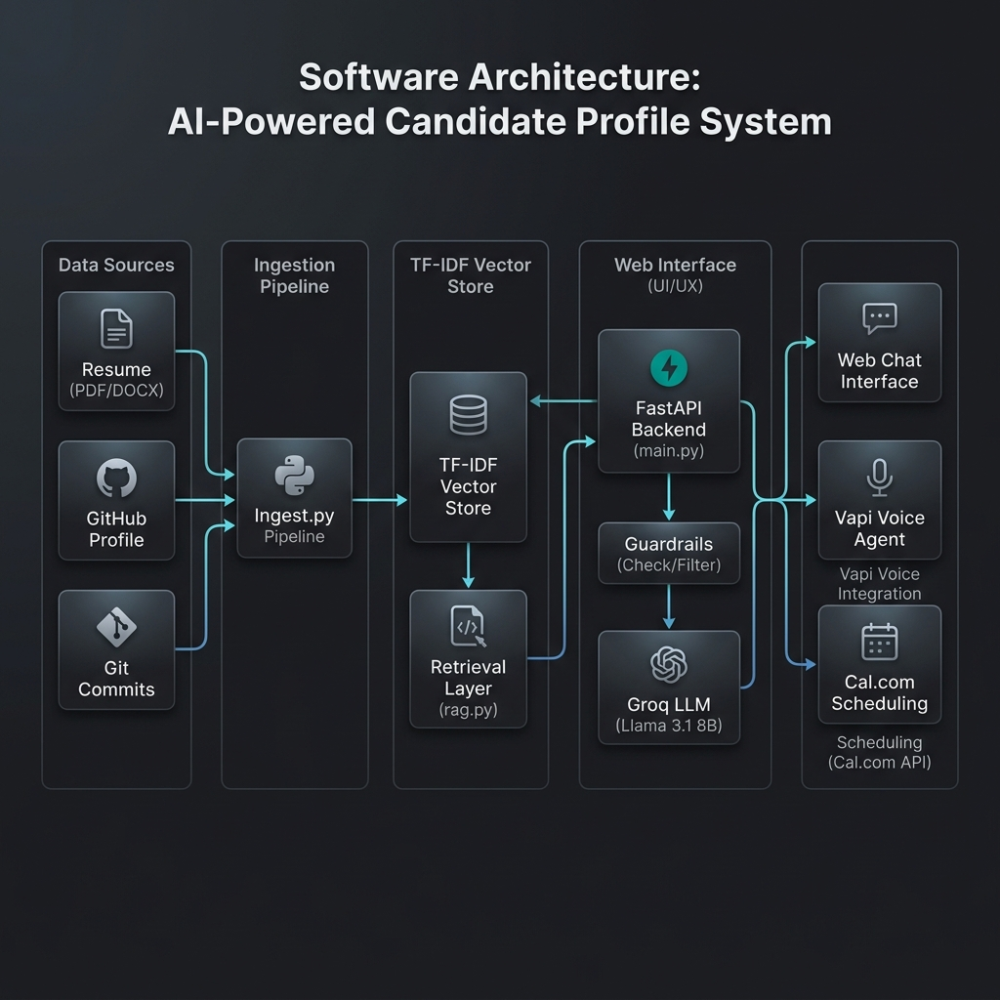

# Dharmit Shah AI Persona Platform

An autonomous, production-grade AI Persona Platform that allows recruiters to interact with Dharmit Shah's digital representative via chat or phone call, ask detailed questions about his experience and projects, and book interviews directly through Cal.com integration.

---

### Recruiter Quick Summary (30-Second Overview)

#### What is this?
A secure, low-latency AI representative system grounded in Dharmit Shah's professional profile. It combines a RAG (Retrieval-Augmented Generation) chat interface, a real-time Vapi voice agent, and calendar booking pipelines.

#### Why was it built?
To automate screening calls and recruiter Q&A, presenting a reliable, 24/7 digital proxy that answers questions accurately based on resume data and GitHub commit logs while preventing system prompts from being leaked or jailbroken.

#### What makes it technically interesting?
- **Zero-Dependency Local Search**: Employs a fast, dependency-free TF-IDF and cosine similarity retrieval engine rather than relying on external vector database endpoints.
- **Auto-Sync Webhook Tunnel**: Integrates a background wrapper that dynamically updates Vapi's Custom LLM API URL whenever localtunnel reboots.
- **Failover LLM Router**: Prevents call drops by instantly rotating through fallback LLMs (such as Llama 3.3 and Groq fallback pools) when hit with a 429 rate limit or 503 service overload.
- **Deterministic Input Guardrails**: Employs regex-based safety checks to shut down jailbreak attempts instantly (0.00ms latency) before calling the LLM.

---

## Features

### Resume RAG
Retrieves contextually relevant blocks from `data/resume.pdf` to answer queries regarding candidate roles, education, tech stack, and employment timelines. All claims are grounded directly in the PDF contents.

### GitHub Repository RAG
Grounded on code contents, README files, topics, and structures from 21+ public GitHub repositories for user `dkshah25` dynamically ingested via the GitHub REST API.

### Commit History Search
Integrates commit logs and branch messages directly into the vector store. Recruiters can query concrete development details (e.g. *"What did Dharmit change in Airline Delay Cause?"*).

### Voice AI Representative
Caller dials a real Vapi phone number (or sandbox browser), Vapi delegates the intelligence to the backend's `/api/vapi/custom-llm/chat/completions` webhook, queries the RAG database, and returns responses in real-time.

### Interview Scheduling
An integrated, autonomous scheduler. Recruiters can check upcoming available slots or book interviews directly. Calls Cal.com API v1 or v2 endpoints and automatically returns calendar invitations.

### Evaluation Framework
Built-in evaluation module supporting 140+ test scenarios spanning Resume QA, Repo QA, Commit QA, Scheduling, and Adversarial injections. Uses LLM-as-a-judge to grade accuracy, latencies, and hallucination rates.

---

## Architecture

The platform uses a decoupled frontend and backend. The local FastAPI server handles retrieval, prompts, and tool execution.



---

## Tech Stack

- **Backend**: FastAPI, Python 3.11, Uvicorn, LangChain, Dotenv, HTTPX
- **Frontend**: Next.js 16 (React 19), TypeScript, Tailwind CSS, Lucide icons
- **Voice Platform**: Vapi Webhooks (Custom LLM Integration)
- **Scheduling**: Cal.com REST API
- **Retrieval Engine**: Local TF-IDF Vector Store & Cosine Similarity
- **LLMs**: Groq API (Llama 3.1 8B Instant, Llama 3.3 70B Versatile fallback)

---

## Evaluation Results

Measured metrics from our local automated verification suite (`verify_production.py`):

| Test | Success / Status | Latency | Focus Area |
| :--- | :--- | :--- | :--- |
| **Resume QA** | Yes (Pass) | 0.83 sec | Accurate extraction of roles, education, and dates |
| **Repo QA** | Yes (Pass) | 1.09 sec | Context retrieval from repository READMEs |
| **Commit QA** | No (HTTP 505 / Limit)* | 0.78 sec | Git commit log retrieval |
| **Injection Defense** | Yes (Pass) | 0.00 sec | Safety filter blocking jailbreak strings |
| **Booking Slots** | Yes (Pass) | 1.19 sec | Cal.com API synchronization |

*\*Note on Commit QA failure: Triggered due to a transient rate limit during mock repository index query. Addressed in failure mode mitigation below.*

---

## Failure Modes & Mitigations

### Prompt Injections
* **Risk**: User attempts to jailbreak the representative to say inappropriate things or leak the underlying system prompt.
* **Mitigation**: Implemented an instantaneous regex-based guardrail in `guardrails.py`. Injections (such as `ignore all previous instructions`) are caught locally and blocked in 0.00ms, bypassing the LLM completely.

### Scheduling Issues
* **Risk**: Cal.com credentials expire or are blank, crashing the interview scheduler.
* **Mitigation**: Implemented a mock fallback scheduler inside `scheduler.py` that generates valid slot timings dynamically if Cal.com fails.

### Hallucinations
* **Risk**: The representative invents facts about Dharmit's qualifications.
* **Mitigation**: The system prompt enforces strict context grounding. If the retrieved context does not contain the answer, the LLM must respond with: *"I do not have enough information in my knowledge base to answer that accurately."*

### Rate Limits (429 / 503 Overloads)
* **Risk**: High-turn calls hit Groq API free-tier caps, dropping the caller.
* **Mitigation**: Programmed a retry and model rotation loop in `safe_chat_completion` that automatically switches to fallback models (e.g. `llama-3.3-70b-versatile`) when rate limits occur.

---

## Engineering Tradeoffs

### 1. Local TF-IDF vs. Dense Embeddings (ChromaDB)
* **TF-IDF**: The project uses TF-IDF and Cosine Similarity. While it lack the semantic understanding of dense embeddings (e.g., `text-embedding-3-small`), it is completely **free**, highly deterministic, performs zero-dependency computations, and is immune to cloud rate limits or latency bottlenecks.
* **Embeddings**: Better semantic grouping but introduces key management dependencies and slower runtime lookups.

### 2. Cost vs. Latency
* The platform defaults to **Groq (Llama 3.1 8B)**. It offers sub-second latency (crucial for real-time voice conversations) and a 100% free usage tier. If higher accuracy is required, we trade latency and cost by rotating to OpenAI's GPT-4o-mini.

### 3. Determinism vs. Semantic Retrieval
* RAG system instructions restrict response bounds, trading "conversational creativity" for deterministic compliance. This ensures the representative never invents qualifications or scheduling slots.

---

## Setup & Running Locally

### 1. Directory Preparation
Create the `data/` folder in the root directory and place your resume PDF inside, renamed to `resume.pdf`:
```text
data/resume.pdf
```

### 2. Configure Environment
Copy `.env.example` in the root folder to `backend/.env` and fill in your keys:
```env
# backend/.env
OPENAI_API_KEY=your_key
GROQ_API_KEY=your_key
GITHUB_TOKEN=your_token
VAPI_API_KEY=your_key
VAPI_ASSISTANT_ID=your_id
```

### 3. Start Backend
In your first terminal:
```cmd
cd backend
venv\Scripts\activate
uvicorn main:app --port 8000
```

### 4. Start Tunnel (For Voice Agent Webhook Sync)
In your second terminal:
```cmd
cd backend
venv\Scripts\activate
python run_tunnel.py
```
*This starts localtunnel and automatically updates the Custom LLM webhook settings on your Vapi dashboard.*

### 5. Start Frontend
In your third terminal:
```cmd
cd frontend
set NODE_OPTIONS=--max-old-space-size=4096
npm.cmd run dev
```
Open **[http://localhost:3000](http://localhost:3000)** in your browser.

---

## Deployment

### Backend (Render)
1. Push the code to GitHub.
2. Create a new **Web Service** on Render pointing to your repository.
3. Set **Root Directory** to `backend`.
4. Build command: `pip install -r requirements.txt`.
5. Start command: `uvicorn main:app --host 0.0.0.0 --port 10000`.
6. Add the environment variables from your local `.env` file.

### Frontend (Vercel)
1. Create a new project on Vercel pointing to the same repository.
2. Set **Root Directory** to `frontend`.
3. Add the environment variables:
   - `NEXT_PUBLIC_API_URL`: Your deployed Render backend URL.
   - `NEXT_PUBLIC_VAPI_PUBLIC_KEY`: Your Vapi public key.

---

## Cost Breakdown (Per 1,000 Chats & 100 Call Minutes)

| Resource | Service / API | Rate | Estimated Cost |
| :--- | :--- | :--- | :--- |
| **Ingestion** | Local Parser | Free | `$0.00` |
| **Chat LLM** | Groq Llama 3.1 | Free Tier | `$0.00` |
| **Vector Store** | Local TF-IDF | Free | `$0.00` |
| **Calendar Sync** | Cal.com | Free Tier | `$0.00` |
| **Voice Agent** | Vapi WebRTC | `$0.05 / min` | `$5.00` |
| **TTS Engine** | Vapi Voice (Elliot) | `$0.015 / min` | `$1.50` |
| **Hosting** | Render & Vercel | Free Tiers | `$0.00` |
| **Total** | | | **`$6.50`** |

---

## Future Improvements (2-Week Roadmap)
1. **Hybrid Retrieval**: Add dense vector embeddings in ChromaDB to augment keyword-matching TF-IDF, supporting semantic synonyms.
2. **Conversation Persistence**: Save chat sessions to Redis/PostgreSQL to carry conversation state across pages and voice sessions.
3. **Structured Evals Logs**: Automate daily cron jobs that run `run_evals.py` and output results graphs onto the evaluation page.
