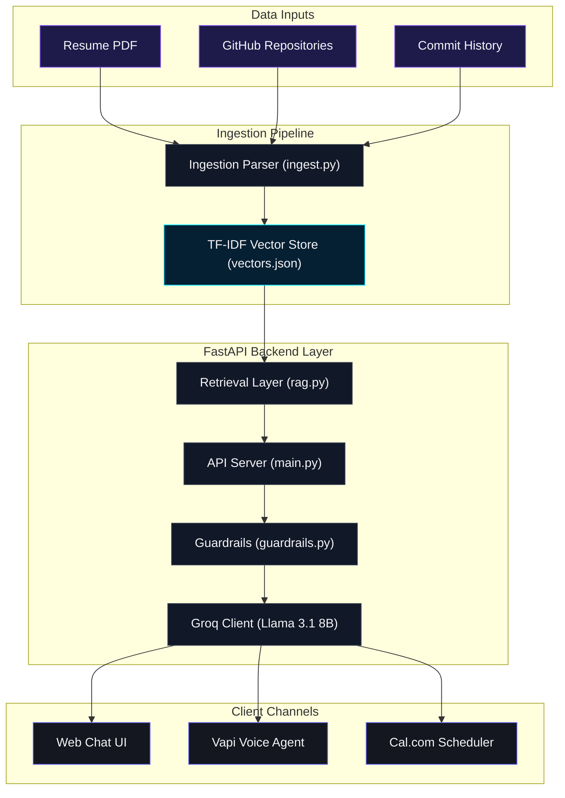

# Architecture Diagram

This diagram visualizes the data flow and integration topology of the Dharmit Shah AI Persona Platform.

```mermaid
graph TD
    %% Styling
    classDef source fill:#1e1b4b,stroke:#8b5cf6,stroke-width:1px,color:#f4f4f7
    classDef process fill:#111827,stroke:#374151,stroke-width:1px,color:#f4f4f7
    classDef database fill:#062033,stroke:#00e5ff,stroke-width:1px,color:#f4f4f7
    classDef channel fill:#151720,stroke:#6366f1,stroke-width:1px,color:#f4f4f7

    %% Data Sources
    subgraph Sources["Data Inputs"]
        Resume["Resume PDF"]:::source
        GitHub["GitHub Repositories"]:::source
        Commits["Commit History"]:::source
    end

    %% Ingestion
    subgraph Ingestion["Ingestion Pipeline"]
        Parser["Ingestion Parser (ingest.py)"]:::process
        Store["TF-IDF Vector Store (vectors.json)"]:::database
    end

    %% Backend
    subgraph Backend["FastAPI Backend Layer"]
        MainAPI["API Server (main.py)"]:::process
        RAG["Retrieval Layer (rag.py)"]:::process
        Guard["Guardrails (guardrails.py)"]:::process
        LLM["Groq Client (Llama 3.1 8B)"]:::process
    end

    %% Channels
    subgraph Channels["Client Channels"]
        Chat["Web Chat UI"]:::channel
        Voice["Vapi Voice Agent"]:::channel
        Cal["Cal.com Scheduler"]:::channel
    end

    %% Connections
    Resume --> Parser
    GitHub --> Parser
    Commits --> Parser
    Parser --> Store
    
    Store --> RAG
    RAG --> MainAPI
    MainAPI --> Guard
    Guard --> LLM
    
    LLM --> Chat
    LLM --> Voice
    LLM --> Cal
```
